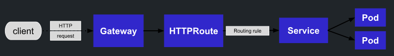
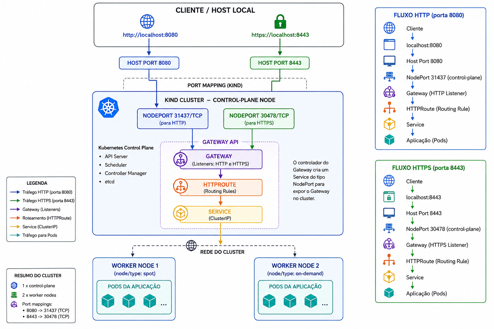

# Autor do projeto
- Prof. Pedro Filho
- Descrição: Esta aplicação é utilizada nas aulas de kubernetes
# Cluster Kind para a Agenda

Este diretório contém uma configuração do Kind com 1 control-plane e 2 workers. A porta `8080` do host é mapeada para a porta `80` do cluster, permitindo acessar o NGINX Ingress em `http://localhost:8080`.

## Pré-requisitos

- Docker
- Kind
- kubectl
- helm

## Versão do KIND
É importante que você esteja com a versão mais recente do kind para que tenha os CRDs do GatewayApi do kubernetes. Atualmente estou a versar a seguir. Assegure-se de ter alguma igual ou maior
```bash
kind --version

kind version 0.32.0
```

## Criar o cluster

Execute a partir da raiz do projeto:

```bash
kind create cluster --config kind/kind-config.yaml
kubectl cluster-info --context kind-cluster-agenda
kubectl get nodes
```

Os dois workers recebem labels para facilitar aulas sobre seleção e agendamento de pods:

- `node/type=spot`
- `node/type=on-demand`

Verifique com:

```bash
kubectl get nodes --show-labels
```

Se o cluster já existir, recrie-o para aplicar as labels do arquivo:

```bash
kind delete cluster --name cluster-agenda
kind create cluster --config kind/kind-config.yaml
```

Ou aplique labels manualmente nos nodes existentes:

```bash
kubectl label node cluster-agenda-worker node/type=spot --overwrite
kubectl label node cluster-agenda-worker2 node/type=on-demand --overwrite
```

## Instalar o NGINX Gateway API Controller

Neste sessão, tomaremos como base a documentação no link a seguir, portanto, pode ser que altere com o tempo é necessário seguir a documentação oficial:
https://docs.nginx.com/nginx-gateway-fabric/get-started/#install-the-helm-chart


Visto que já criamos o cluster, vamos instalar o NGINX Gateway Fabric. Se dará em 2 etapas:

- 1º Etapa, instalando os CRDs do kubernetes para ativar os recursos de GatewayAPI

```bash
# Nenhum Gateway API
kubectl api-resources | grep gateway
# Instalando os CRDs
kubectl kustomize "https://github.com/nginx/nginx-gateway-fabric/config/crd/gateway-api/standard?ref=v2.6.3" | kubectl apply -f -
# Agora temos a api do recurso de gateway em nosso cluster
kubectl api-resources | grep gateway
```

- 2º Etapa, aqui usamos o helm para instalar o pacote de GatewalClass do Nginx no kubernetes.
O GatewayClass é o componente que representará nosso NGINX Proxy para a aplicação
```bash
helm install ngf oci://ghcr.io/nginx/charts/nginx-gateway-fabric --create-namespace -n nginx-gateway --set nginx.service.type=NodePort --set-json 'nginx.service.nodePorts=[{"port":31437,"listenerPort":80}, {"port":30478,"listenerPort":443}]'
```

Neste momento, foi criado um namespace nginx-gateway, e lá dentro estão o Deployment, Replicaset, POD e Service do nosso GatewayClass.
```bash
kubectl -n nginx-gateway get all
```

Fluxo dos componentes do GatewayAPI do Kubernetes


## Construir e carregar as imagens

Execute na raiz do projeto:

```bash
docker build -t agenda-backend:1.0.0 ./backend
docker build -t agenda-worker:1.0.0 ./worker
docker build -t agenda-frontend-k8s:1.0.0 ./frontend

kind load docker-image agenda-backend:1.0.0 --name cluster-agenda
kind load docker-image agenda-worker:1.0.0 --name cluster-agenda
kind load docker-image agenda-frontend-k8s:1.0.0 --name cluster-agenda
```
Por enquanto não estamos utilizando um registry tipo github para armazenar nossas imagens, então, o jeito é após o build local na nossa máquina, transferir as imagens para todos os hosts do cluster, desta forma, quando o POD realizar um pull da imagem, ela já estará dentro do host.


## Aplicar a aplicação

```bash
kubectl apply -f k8s/
kubectl get pods -n agenda -w
```

Adicione em /etc/hosts uma entrada de resolução de nome
```text
127.0.0.1   agenda.com  www.agenda.com
```
Quando todos os pods estiverem `Running` ou `Ready`, acesse:
- Frontend: `http://agenda.com:8080/`
- API: `http://agenda.com:8080/api/docs`
- Mailpit: `http://agenda.com:8080/emails/`

Fluxo das requisições da aplicação




## Instalar Metrics Server para testar o HPA

O HPA precisa de métricas de CPU. Para ambiente local com Kind:

```bash
# Antes de instalar o metrics
kubectl top pods  -n agenda

# Instalando o metrics
kubectl apply -f https://github.com/kubernetes-sigs/metrics-server/releases/latest/download/components.yaml
kubectl patch deployment metrics-server -n kube-system --type=json \
  -p='[{"op":"add","path":"/spec/template/spec/containers/0/args/-","value":"--kubelet-insecure-tls"}]'

# Após instalar o metrics
kubectl top pods  -n agenda
```

Verifique:

```bash
kubectl top nodes
kubectl get hpa -n agenda
```

## Comandos úteis

```bash
kubectl get all -n agenda
kubectl logs -n agenda deploy/backend --follow
kubectl logs -n agenda deploy/worker --follow
kubectl describe ingress -n agenda
```

## Remover o cluster

```bash
kind delete cluster --name cluster-agenda
```
